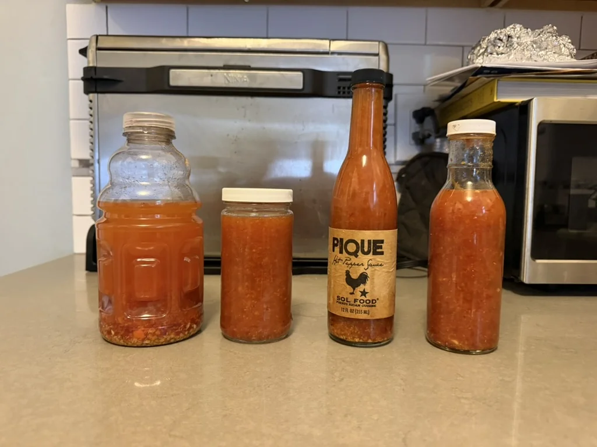

# PiqueOps 🌶️

**Actual sauce. Excessive project management.**

A useful little kitchen app for making Sol Food-inspired pique sauce, scaling the ingredients, and remembering why the last batch was good. For meat, rice, and beans. Your dinner has enough problems without a Jira ticket.



## Make dinner

Requires Node.js 20 or newer. No dependencies, accounts, API keys, or discovery calls.

```sh
npm run demo
```

Open **http://127.0.0.1:4173**. The app includes:

- The actual recipe, with half, single, double, and triple batches.
- Ingredient checkboxes shared with a shopping list you can copy or download.
- US measures, or rounded milliliters for liquids. No invented pepper weights.
- A 12 / 24 / 48-hour fridge-soak planner and a ten-minute simmer check-in.
- A printable recipe and a batch notebook for pepper swaps, actual soak time, and tasting notes.
- A comparison of your two most recent batches, plus JSON backups you can export and import.

The timer keeps its deadline across reloads. It gives an on-screen cue while the page is open; it does not run a background alarm. The soak planner does not send notifications. Check the carrot, not just the clock.

Notes and cooking progress are stored in this browser on this device. Export a backup before changing browsers, clearing site data, or switching between local and hosted copies. Imports add missing records and preserve existing records with the same ID. The notebook supports up to 100 batches.

## The actual recipe

The baseline is [Husbands That Cook’s pique sauce](https://www.husbandsthatcook.com/2016/08/pique-sauce/), adapted from Scot Lang and inspired by Sol Food. It is **not** Sol Food’s official recipe. The app credits the source beside the recipe; the method is a short original summary. Visit the source for its full story and notes.

Jake started with that recipe and began experimenting with chiles and vinegar-soak times. The photograph above is his batch. Notebook entries are yours; nothing is prefilled to pretend we cooked it for you.

Keep the soak and finished sauce refrigerated. This app does not provide a shelf-stable canning process or a storage-life guarantee. If you want to can sauce, follow a [tested preservation recipe](https://nchfp.uga.edu/how/can/how-do-i-can-tomatoes/easy-hot-sauce/) designed for that purpose.

## Dinner, from the terminal

```sh
node bin/piqueops.js recipe
node bin/piqueops.js recipe --scale 2
node bin/piqueops.js shopping --scale 0.5 --metric
node bin/piqueops.js shopping --json
```

The CLI shares the app’s recipe data and scaling logic. Its output goes to stdout; it makes no network requests and writes no files. Redirect the shopping list to a file if you like. Procurement has approved this.

## The deeply unnecessary control room

The optional **[lab](docs/lab/index.html)** is condiment operations satire: deploy batches, trigger incidents, roll back, refill the jar, and export blameless postmortems. It runs locally at **http://127.0.0.1:4173/lab/**.

```sh
node bin/piqueops.js status
node bin/piqueops.js deploy --heat 75000
node bin/piqueops.js incident --scenario cap-lock --json
node bin/piqueops.js postmortem --scenario label-drift --markdown
```

All operations telemetry, heat readings, incidents, and service metrics are fictional. Each CLI operations command starts an independent simulation. The browser lab keeps its simulation state separately from your real batch notes. Nobody is paged. Jake can have lunch.

No Kubernetes. We tried putting the jar in a cluster, but it was just a shelf.

## Development

```sh
npm run check
npm test
```

Tests cover recipe scaling and liquid conversions, per-bottle quantities, timer deadlines, soak calculations, backup validation, CLI errors, and the lab’s incident/rollback behavior. CI runs on Node.js 22 and 24.

```text
docs/index.html       Recipe companion
docs/cook.js          Browser interactions and local notebook
docs/cook.css         Responsive layout and print styles
docs/recipe.js        Shared source quantities and kitchen utilities
docs/lab/             Optional operations joke
docs/kitchen.js       Pure operations simulation
bin/piqueops.js       Recipe tools and operations CLI
test/                 Node’s built-in test runner
```

Everything in `docs/` is a static site. To publish with GitHub Pages, choose **Deploy from a branch**, the repository’s default branch, and **/docs**. Relative asset paths support a project URL such as `/piqueops/`. No build step or server is needed on the host.

## Frequently escalated questions

**Why not use a piece of masking tape?**  
Excellent architecture. Difficult to export.

**What does the heat rating measure?**  
Your opinion, from 1 to 5. Peppers do not have an observability endpoint.

**Is there an enterprise plan?**  
Two jars and a meeting.

**What happens if the timer expires?**  
Check your vegetables. This is the only incident response that matters.

---

Made by [Jake Heller](https://jakeheller.fyi). Small tool. Actual dinner.
